# 737-2023-t1-prac9.1P

## GitHub Repository:

https://github.com/DaGoblin/737-2023-t1-prac9.1P.git

Setup has a 3 Stateful Set of mongo DB running along with a 3 replica set of a Authorisation Node.js app that can perform CRUD operations storing data in Mongo DB.

## Kubernetes Dashboard showing deployment and Pod setup

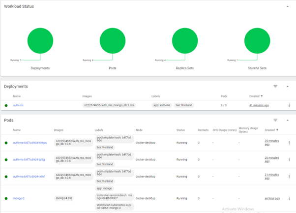

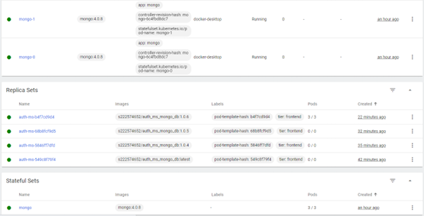

Kubectl results for get commands

-   kubectl get secret
-   kubectl get service
-   kubectl get pv
-   kubectl get pvc
-   kubectl get statefulset
-   kubectl get deployment
-   kubectl get configmap

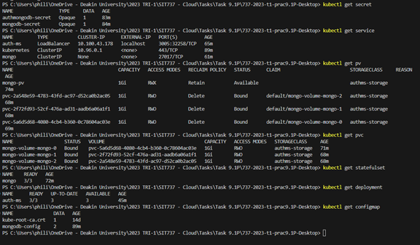

## Setup Commands and scripts

-   kubectl apply -f .\createConfigMap.yaml
-   kubectl apply -f .\createMongoDbSecret.yaml
-   kubectl apply -f .\createMongoDBUserSecret.yaml
    -   Not Actually used at the moment as MongoDB is not doing authentication at the moment but Secret is accessible inside Auth_MS as an environmental variable
-   kubectl apply -f .\createPersistantVolume.yaml
-   kubectl apply -f .\createStorageClass.yaml
-   kubectl apply -f .\createStatefulSet.yaml
-   kubectl apply -f .\createHeadlessService.yaml
-   kubectl apply -f .\createDeployment.yaml
-   kubectl apply -f .\createServiceNode.yaml

### Docker Image update and release

AuthMS docker Image built and updated with script  
`release.sh`

### AuthMS port-forwarding

Command to port forward AuthMS to host OS (will look at how to make this permanent or other ways of accessing MS in cluster)

`kubectl port-forward deployment/auth-ms 3010:4000`

## Testing and verification (CRUD)

### Create User (create)

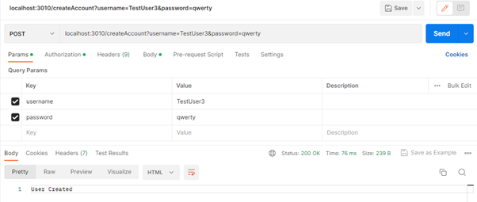

### Login User (Retrieve)

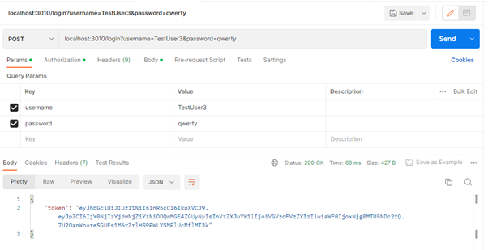

### Update Password (Update)

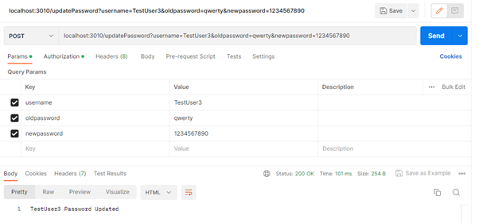

### Show Password has changed

#### Old Password

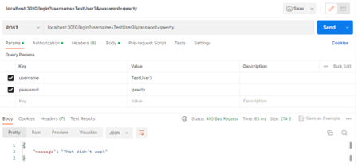

#### New Password

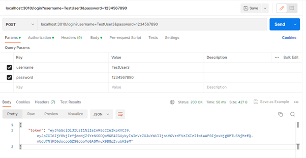

### Delete User (Delete)

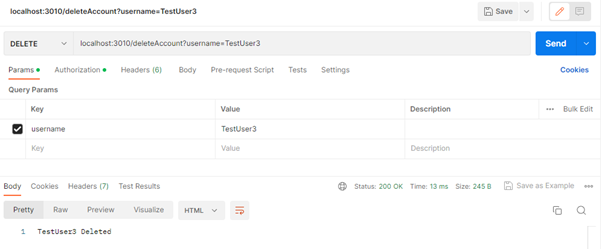

## Mongo DB Replica set updating

show's MongoDB containers are replicating

### Primary

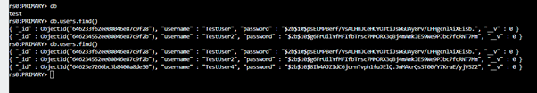

### Secondary

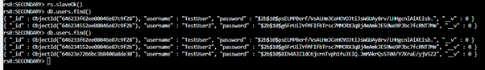
